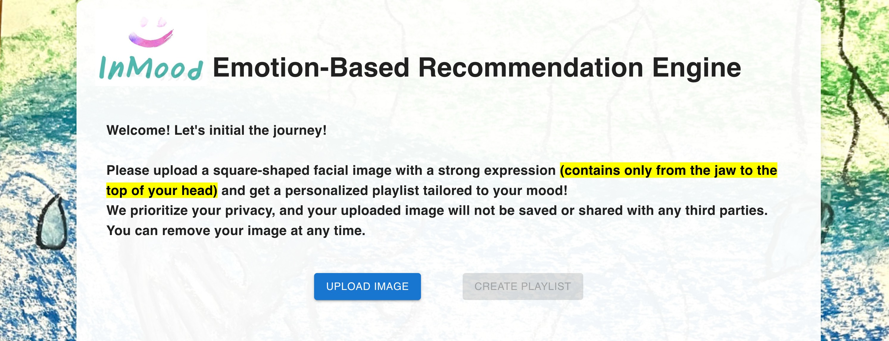
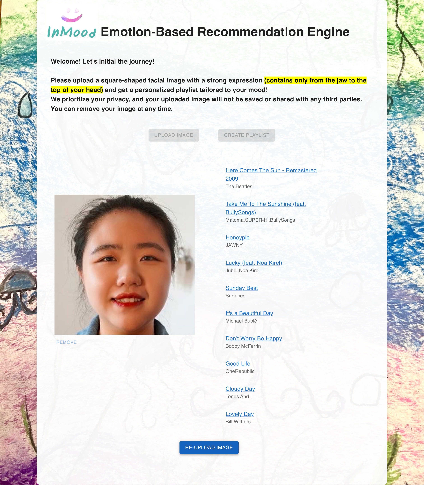
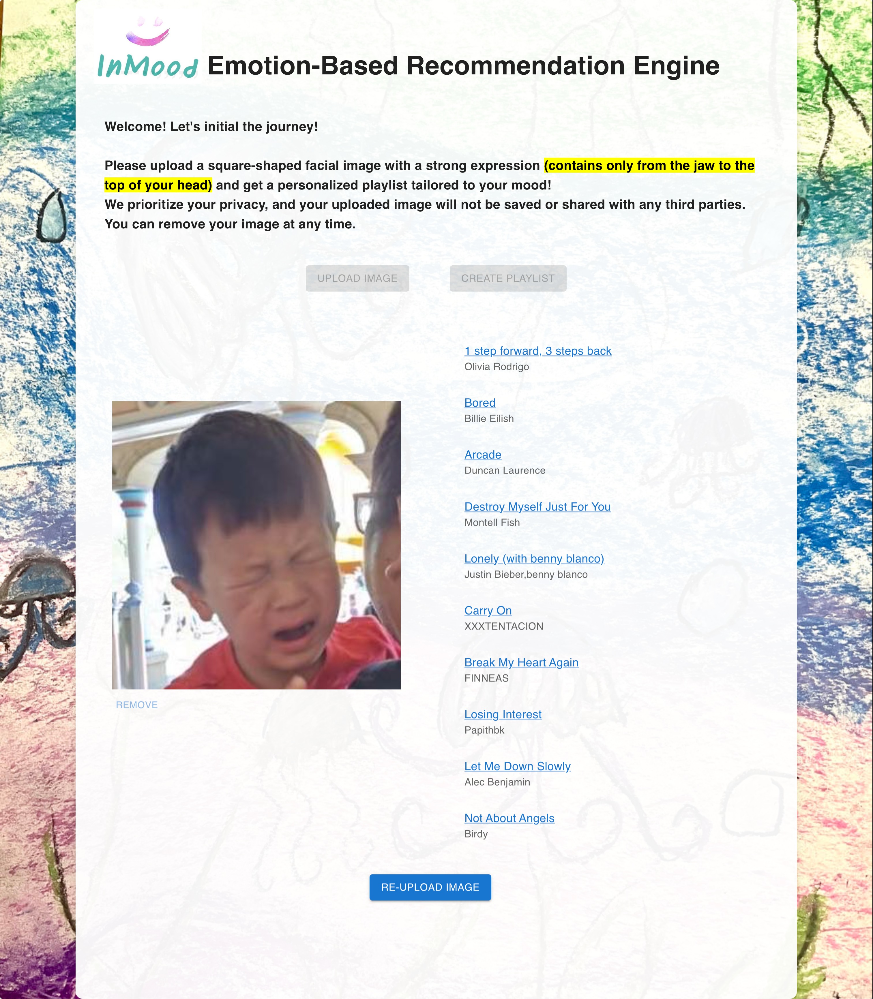

# InMood Facial Expression Identification Engine

At the heart of InMood is a cutting-edge facial expression identification engine that revolutionizes music recommendation. Our team developed this technology to provide users with a truly personalized and unique customized experience that goes beyond traditional recommendation strategies. Our engine is powered by a sophisticated convolutional neural network (CNN) algorithm that has been trained on a vast dataset of over 28,000 [facial images](https://www.kaggle.com/datasets/astraszab/facial-expression-dataset-image-folders-fer2013) with 7 emotion labels.
 
The aim of InMood is to provide users with a truly personalized and unique experience that goes beyond traditional recommendation strategies. By harnessing the power of facial expressions as potent indicators of emotions, InMood taps into this rich source of information to curate music playlists, video recommendations, potential loved goods, and more that deeply resonate with users on an emotional level.

## Model Architecture (CNN)

This model architecture starts with four 2-dimensional convolutional layers followed by 2 fully connected layers with a Softmax layer at the end to align with the purpose of multi-class classification. Such a model structure resembles AlexNet because of its outstanding performance in image classification for most of the image datasets. Especially, this model uses nonlinear activation functions, regularization and data augmentation techniques after each convolutional layer that allow the model to capture more discriminative features from the image input:

- Nonlinear activation functions: this model uses Rectified Linear Units (ReLU), which allows the network to learn more complex decision boundaries.

- Data augmentation: this model applies various data augmentation techniques to the input images, such as cropping, flipping, and color jittering. These techniques help the network to learn invariant features that are robust to changes in the input image.

- Regularization: this model uses regularization techniques such as dropout and weight decay to prevent overfitting and improve generalization.

## Application: InMood Emotion-Based Music Playlist Generator
To showcase the power of InMood, we created a demo that generates customized music playlists based on users' uploaded images, accurately analyzing their facial expressions to determine their emotions.
InMood's unparalleled level of personalization, emotional resonance, and adaptability makes it a superior choice over traditional music recommendation strategies. Our technology delivers an exceptional music listening experience that truly connects with users on a deep emotional level.

### **Demo Link: [InMood - Streamlit](https://persecond17-facial-expression-identificati-streamlit-app-zz75dx.streamlit.app/)**
### **Demo Link: [InMood - React](https://inmood.netlify.app/)**

### Steps
Using the InMood Emotion-Based Music Playlist Generator is remarkably simple and user-friendly.

- Users can easily upload their facial images with just one click of a button, **ensuring that the image contains only from the jaw to the top of their head**.
- The InMood engine then performs real-time analysis of their facial expressions when the "Create Playlist" button is clicked.
- Based on the emotions detected, the InMood engine generates a customized playlist that aligns perfectly with the user's current mood and emotional state.
- With just one click, users can easily jump to Spotify and start listening to their personalized playlist created by InMood, embarking on an emotional music journey tailored to their individual mood.

### Examples

### Superiority
The InMood Emotion-Based Music Playlist Generator boasts numerous advantages over traditional music recommendation strategies.

- It delivers a highly personalized and emotionally resonant music experience by taking into account the user's current emotional state based on their facial expressions.
- By analyzing facial expressions in real-time, it captures the user's ever-changing emotional state throughout the day, generating dynamic and adaptive music playlists accordingly, providing frequent and tailored playlists as desired.
- Furthermore, the InMood engine can be seamlessly integrated into a wide range of scenarios, such as during workouts, relaxation sessions, or social gatherings, where users may have varying emotional states and music preferences.

## Cooperation
We're open to collaborating with other platforms and applications. The InMood facial expression identification engine can seamlessly integrate into existing content, product, or ad streaming, enhancing their recommendation capabilities and providing a distinct competitive edge.

## Team
- [Yichen Zhao](mailto:alexyczhao@gmail.com) is responsible for developing, training, and deploying the CNN model.
- [Xin Ai](mailto:xinnnnn.ai@gmail.com) is in charge of full-stack development and implementing the cloud-based launch on AWS.
- [Xinyi (Jessica) Wang](mailto:wangxinyi1986@gmail.com) is responsible for overseeing the questionnaire design and environment configuration.
- [Chuyi (Joy) Huang](mailto:chuang86@usfca.edu) handles marketing research and strategy to drive the success of the final product.

## Source

- [https://github.com/NJNischal/Facial-Expression-Recognition-with-CNNs](https://github.com/NJNischal/Facial-Expression-Recognition-with-CNNs)
